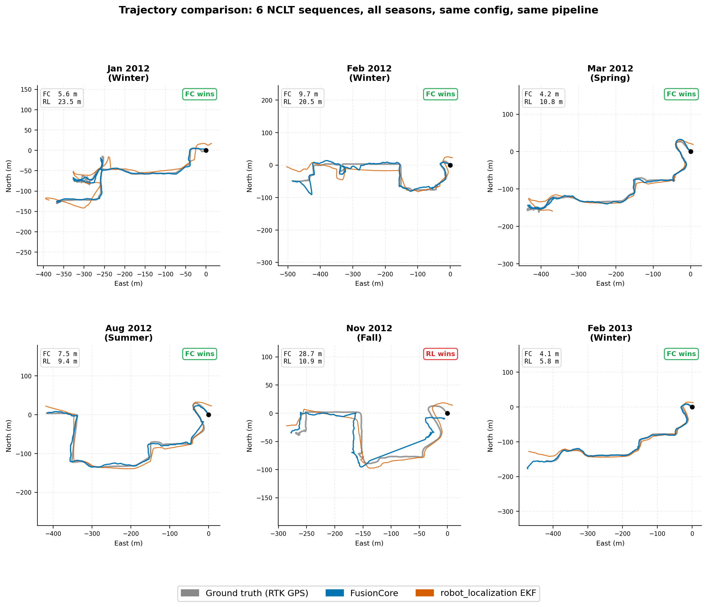

# FusionCore

[](https://github.com/manankharwar/fusioncore/actions/workflows/ci.yml)
[](https://arxiv.org/abs/2605.25239)
[](https://doi.org/10.5281/zenodo.20091053)
[](https://manankharwar.github.io/fusioncore/)
[](https://manankharwar.substack.com)

**A 23-state UKF for outdoor robots: IMU, wheel encoders, GPS and visual SLAM at 100 Hz. Two numbers from your IMU datasheet instead of days of tuning, and when the estimate goes wrong it names the sensor and the reason instead of drifting silently. Apache 2.0, ROS 2 Jazzy and Humble, and the filter itself is a plain C++ library with no ROS dependency.**


---

## Start without installing anything

If you have a rosbag, you can get something useful out of this before you build it.
Point `bag_report.py` at the bag and it tells you what is wrong with your estimation
setup, in terms of your robot rather than a benchmark dataset:

```bash
python3 tools/bag_report.py /path/to/your/bag
```

No config, no ROS distro to match, and every check works with no ground truth, which
is the point: almost nobody has a surveyed reference for their own robot. It reports
things like whether your IMU and your wheels disagree about which way the robot
turned, whether two sensors are on different clocks, and whether the bag even
contains a manoeuvre that makes heading observable. Details in
[docs/bag-report.md](https://manankharwar.github.io/fusioncore/bag-report/).

The first bag it was ever run on had an IMU and wheel encoders reporting opposite
yaw-rate signs on 100% of turns, over 127,419 samples. That bag was from this
project's own benchmark harness, and the bug had been there for every number it had
ever published.

---

## Answers to the things that stop people trying it

**Yes, you can run it beside robot_localization rather than instead of it.** Same bag,
same inputs, both filters, compare the two trajectories. That is how the numbers here
were produced, and `fusioncore_ros/tests/test_rl_interface_conformance.py` locks the
interface so it stays a drop-in comparison rather than a rewrite.

**Yes, your existing robot_localization config converts.** `tools/rl_to_fusioncore.py`
reads it and emits the FusionCore equivalent, because that config already encodes
everything you learned about your robot. It refuses to guess: anything that does not
map cleanly comes out as a commented `TODO` with the reason, repeated on stderr so it
is visible when you redirect stdout to a file. A config that looks complete but
quietly invented a number is worse than one that admits what it does not know.

**No, you do not need ROS 2.** The filter is a plain C++ library with Eigen and no ROS
dependency. The ROS 2 wrapper is a separate package you can ignore.

**No, you do not need ground truth to evaluate it.** `tools/bag_report.py` works
entirely on raw sensor topics, because almost nobody has a surveyed reference for
their own robot. It will not give you an accuracy number, and it says so rather than
inventing one.

**Yes, it runs on a Raspberry Pi 4.** Well under 1 ms per cycle in a Release build,
same source on ARM and x86. Build unoptimised and it is drastically slower, so do not
skip `CMAKE_BUILD_TYPE`.

**No, you should not trust the benchmark table below right now.** Five of its twelve
rows have been re-measured at n=2 on corrected input, and the headline claim that stood
here, that FusionCore beat robot_localization on ten of twelve, did not survive it:
**FusionCore wins two of the five and loses three**, and one row reversed outright from
a published 81% win to a measured 20% loss. The cause was a frame error in the dataset
player (#169) that fed a wrong wheel-odometry yaw rate to **both** filters, so the old
numbers describe an input that no longer exists in either column. The other seven rows
have not been re-run and nothing should be concluded from them. If a benchmark table in
a README has never been wrong, nobody has checked it.

**What is defensible today.** FusionCore rejects GPS fixes that are kinematically
impossible, and that one is provable from physics without any reference: a 60 m jump in
one second cannot happen to a 1.5 m/s robot. On NCLT, post-fix, it is **5.0x and 4.7x
better** than robot_localization on the two sequences where it wins, and 1.2x, 1.8x and
15x worse on the three where it loses. The spread is the open problem and it is being
worked; the average is not the interesting number and neither is a win count.

---

## Quick start

```bash
sudo apt install ros-jazzy-fusioncore     # or ros-humble-fusioncore
```

Or from source:

```bash
mkdir -p ~/ros2_ws/src && cd ~/ros2_ws/src
git clone https://github.com/manankharwar/fusioncore.git
cd ~/ros2_ws
rosdep install --from-paths src --ignore-src -r -y
colcon build --packages-up-to fusioncore_ros
source install/setup.bash
```

Check it works before wiring it to a robot. This starts the filter with fake sensors and verifies every output, in about 15 seconds:

```bash
bash tools/quick_test.sh
```

Then point it at your robot:

```bash
ros2 launch fusioncore_ros fusioncore.launch.py \
  fusioncore_config:=/path/to/your_robot.yaml
```

The launch file brings the lifecycle node all the way up to `active` on its own. Pass `autoconfigure:=false` if a `nav2_lifecycle_manager` should own it instead.

Docker, if you would rather not install ROS 2: [docs/docker.md](https://manankharwar.github.io/fusioncore/docker/)

```bash
docker run --rm ghcr.io/manankharwar/fusioncore:latest bash tools/quick_test.sh
```

---

## When it goes wrong, it tells you why

Most localization debugging is not a mathematics problem. The filter drifts, and the hard part is working out which of six sensors caused it. FusionCore publishes what it is thinking while it runs, on real hardware:

```bash
ros2 topic echo /fusion/debug/gnss_status     # one message per GPS fix
ros2 topic echo /fusion/debug/filter_health   # filter state at 1 Hz
```

`gnss_status` answers "why was that fix dropped?" for every fix. A `rejection_reason` (`CHI2_FAILED`, `SIGMA_XY_HIGH`, `IMPLAUSIBLE_JUMP`, `DELAY_TOO_LARGE` and the rest), the Mahalanobis distance printed next to the threshold it was actually tested against, and the filter's own position sigma at that moment.

`filter_health` answers "does this filter even know which way it is pointing?" Per-sensor innovation norms, heading uncertainty in degrees, which source the heading came from (`GPS_TRACK`, `MAGNETOMETER`, `DUAL_ANTENNA`, `NONE`), and a separate count of measurements dropped because two drivers disagree about the clock rather than because the data was bad.

That last distinction matters more than it sounds. A sensor whose timestamps run behind the filter clock is not being fused at all, and from the outside that looks exactly like a badly tuned filter.

You can also ask, after the fact, whether the covariance the filter reported was honest. This needs no ground truth and works on any recorded bag:

```bash
python3 tools/nis_from_bag.py /path/to/your_bag
```

Details: [Is your filter's covariance honest?](https://manankharwar.github.io/fusioncore/guides/filter-consistency/)

---

## What FusionCore does not do

Every project has these. Most do not write them down.

**Yaw is not observable from a 6-axis IMU, wheel encoders and GPS position alone.** The gyro measures `wz + gyro_bias` and the encoder measures `wz + encoder_bias`, which is two equations for three unknowns. GPS track heading only helps while the robot moves in a straight line fast enough for the displacement bearing to beat the position noise. Add a magnetometer or dual-antenna GNSS heading and the problem goes away. Without one, expect heading uncertainty to grow during slow or twisty driving, and read `heading_sigma_deg` in `filter_health` rather than assuming.

**The chi-squared gate is less sensitive than its nominal threshold on a smoothing receiver.** Many GNSS receivers report their absolute accuracy, several metres dominated by multipath, while emitting fixes that agree with each other to centimetres because they filter internally. A Kalman filter assumes white measurement noise, so it gets handed a covariance far larger than any innovation it will see, and the gate then sits much further above typical than its 99.9% design point suggests. Measure yours with `nis_from_bag.py` before relying on the gate.

**Long GPS blackouts still accumulate heading error.** Beyond roughly five to seven minutes of dead reckoning, residual bias drift dominates. See [known limitations](https://manankharwar.github.io/fusioncore/known-limitations/).

---

## Built around the problems real robots have

| The problem | How FusionCore handles it |
|---|---|
| **IMU calibration is approximate** | Gyro and accel bias are filter states, estimated continuously. `init.stationary_window: 2.0` estimates startup bias before motion begins. |
| **Extrinsic calibration is never exact** | Reads `frame_id` from every IMU message and looks up the TF rotation to `base_link` automatically. Set `imu.frame_id` to override broken frame names from drivers. No manual rotation matrices. |
| **Sensors disagree about what time it is** | Stamps more than 1 s from the node clock warn at startup. A sensor lagging the filter clock is rejected as stale rather than being allowed to corrupt it, and the count is published so you can see it happening. |
| **GPS arrives late (50 to 200 ms)** | An IMU ring buffer replays the buffered updates when a delayed fix arrives, reconstructing the state at the GPS timestamp rather than approximating it. The buffer holds 100 IMU samples, one second at 100 Hz, but the usable window is `max_measurement_delay` (0.5 s by default): a fix older than that is dropped rather than replayed. |
| **Wheel odometry is noisy or slipping** | Adaptive noise covariance updates from the innovation sequence. Optional GPS velocity fusion compares GPS speed against wheel speed every cycle, so the innovation reveals slip and the gain down-weights it. |
| **Noise parameters need days of tuning** | Two numbers from your IMU datasheet, `imu.gyro_noise` and `imu.accel_noise`. The adaptive estimators handle the rest, though a bad frame or a bad timestamp will still need fixing by hand. |
| **The robot runs on a Raspberry Pi** | Well under 1 ms per cycle on a Pi 4 in a Release build. Same source on ARM and x86 via Eigen. Build unoptimised and it is drastically slower, so do not skip `CMAKE_BUILD_TYPE` (0.3.8 and later default to Release). |
| **Two IMUs on the platform** | Set `imu2.topic` to fuse a second IMU as an independent measurement. No pre-merging needed. |
| **GPS drops out under canopy** | Inertial coast mode holds position through sustained dropout, and the gate relaxes on re-acquisition after a genuine gap rather than after a sustained outlier. |
| **The robot sits still for minutes** | ZUPT fuses a zero-velocity pseudo-measurement when encoder speed and angular rate are both below threshold, so IMU noise does not integrate into drift while idle. |


---

## What it costs you to run

Accuracy is the easy claim to make and the hard one to verify, especially on a robot
nobody has surveyed. These are the costs, which you can check against your own setup
in an afternoon:

| | |
|---|---|
| **Tuning** | Two numbers, `imu.gyro_noise` and `imu.accel_noise`, both off your IMU datasheet. The adaptive estimators handle the rest. A bad frame or a bad timestamp still needs fixing by hand, and the tools below find those. |
| **Finding out why it drifted** | Every sensor has a named rejection reason, and the gated ones carry their chi-squared value too, published on a debug topic while it runs. So "it drifts" becomes a count per reason rather than a guess about which of six sensors did it. |
| **Knowing whether to trust it** | The filter reports which quantities are actually observable and what to drive to fix the rest, rather than leaving you to infer it. See [Observability](https://manankharwar.github.io/fusioncore/observability/). |
| **Catching a config typo** | ROS 2 silently ignores an override for a parameter a node never declared, so a typo tunes nothing and warns nobody. `tools/check_config_params.py` fails on it. |
| **Evaluating it at all** | `tools/bag_report.py` on a recording, before you build anything. |

Three of those five exist because they were the thing that cost days here first. The
observability report exists because three separate issues in this project turned out
to be "the robot was never driven in a way that made this observable", and nothing
said so for weeks.

---

## Benchmark

FusionCore against robot_localization on the [NCLT dataset](http://robots.engin.umich.edu/nclt/): same IMU, wheel odometry and GPS, no manual tuning, twelve full-length sequences across all seasons. RL-EKF run with chi-squared-equivalent thresholds at 99.9% confidence.

> **Status, 2026-10-10.** Five of these twelve rows have been re-measured at n=2 after
> fixing #169, a frame error in the dataset player that fed a wrong wheel-odometry yaw
> rate to **both** filters. On those five **FusionCore wins two and loses three**, and
> 2012-02-04 flipped from a published 81% win to a measured 20% loss. The other seven
> have not been re-run. Their May 2026 run records exist and match the published figures
> to three decimals, so the table was measured rather than invented, but it was measured
> through the same faulty player and nothing should be concluded from those rows in
> either direction.
>
> Measured, post-fix: 2013-04-05 **5.0x better** than robot_localization, 2012-09-28
> **4.7x better**, 2012-02-04 1.2x worse, 2012-06-15 1.8x worse, 2012-08-20 **15x worse**.
> The spread, not the average, is the open problem. Two identified defects sit inside
> every one of these numbers: #150 and #148. See `tools/benchmark_regression.md`.
>
> | Sequence | Published (May 2026) | Measured since | RL-EKF control, published vs measured |
> |---|---|---|---|
> | 2012-06-15 | 49.2 m | **73.5 m** (`bcc0e09`), confirmed **73.3 m** on current `main` 2026-10-05 | 18.2 m vs 18.487 then 18.489 m |
> | 2012-08-20 | 98.3 m | **116.4 m** (`bcc0e09`), now **145.2 m** on current `main` 2026-10-05 | 10.6 m vs 10.519 then 10.507 m |
> | 2013-04-05 | 12.1 m | **189.7 m** (`bcc0e09`), then **50.2 m** (2026-10-03) | 268.9 m vs 266.7 to 268.8 m |
>
> The RL-EKF control reproduces within 2% on all three rows. That is what rules out the harness and places the move in FusionCore's own column. On 2013-04-05 the margin over RL-EKF is 81% at the current figure and 29% at the September one, not the 93% this note claimed until 2026-10-05, and the 19.4 m it quoted is not supported by any run on file. The other nine rows have no run record and have not been re-measured in either direction.
>
> The two rows re-measured on 2026-10-05 are load-bearing because their controls held: the RL-EKF figure moved **+0.01%** on 2012-06-15 and **-0.11%** on 2012-08-20, against an established band of under 1%. 2012-06-15 is now confirmed three independent times and sits inside its own n=8 spread. 2012-08-20 is worse than previously recorded and is a genuine regression, outside its 4.57% spread, so the baseline has deliberately not been moved to match it. The 2013-04-05 arm of that re-run is **void**: its control moved -4.40% after 20 `rl_ekf` update-rate misses, so it was CPU-starved and says nothing. It is being re-run.
>
> **CORRECTED 2026-10-09.** Five of these twelve rows have now been re-measured at n=2
> after fixing #169, a frame error in the NCLT player that fed a wrong wheel-odometry yaw
> rate to BOTH filters. **On those five, FusionCore wins two and loses three.** The other
> seven were measured in May 2026 through the faulty player and have never been re-run, so
> nothing should be claimed about them. The earlier note here, that the overstatement was
> systematic at about 1.48x, is withdrawn: across five rows the ratio runs 0.83x to 3.08x
> and the control swings 0.24x to 2.52x despite sharing no code. See the table and the
> explanation in the repository README.
>
> `tools/benchmark_regression.md` is the standing rule: no published number changes without a `verified` baseline entry and a clean regression check. Rows this note affects are marked † in every table on this page.

| Sequence | Season | Duration | FC ATE RMSE | RL-EKF ATE RMSE | Winner | Status |
|---|---|---|---|---|---|---|
| 2012-01-08 | Winter | 92 min | 18.6 m | 41.2 m | FC +55% | ‡ never verified |
| 2012-02-04 | Winter | 77 min | **153.5 m** | **123.1 m** | **RL +20%** | re-measured, n=2 |
| 2012-03-31 | Spring | 87 min | 22.0 m | 156.5 m | FC +86% | ‡ never verified |
| 2012-05-11 | Spring | 84 min | 9.7 m | 11.5 m | FC +16% | ‡ never verified |
| 2012-06-15 | Summer | 55 min | **82.0 m** | **45.9 m** | **RL +44%** | re-measured, n=2 |
| 2012-08-20 | Summer | 83 min | **155.6 m** | **10.4 m** | **RL +93%** | re-measured, n=2 |
| 2012-09-28 | Fall | 77 min | **18.6 m** | **87.2 m** | **FC +77%** | re-measured, n=2 |
| 2012-10-28 | Fall | 85 min | 15.6 m | 56.4 m | FC +72% | ‡ never verified |
| 2012-11-04 | Fall | 79 min | 60.1 m | 122.0 m | FC +51% | ‡ never verified |
| 2012-12-01 | Winter | 75 min | 21.0 m | 90.7 m | FC +77% | ‡ never verified |
| 2013-02-23 | Winter | 78 min | 59.4 m | 82.2 m | FC +28% | ‡ never verified |
| 2013-04-05 | Spring | 68 min | **14.1 m** | **65.5 m** | **FC +79%** | re-measured, n=2 |

**Read the five bold rows and ignore the rest.** Those five were re-measured on 2026-10-09
at n=2 each, after a bug fix described below. The seven rows marked ‡ were measured in May
2026 through a dataset player that is now known to have been wrong, and they have not been
re-run. They are left in the table only so the correction is visible; **no claim should be
built on them in either direction.**

**On the five rows that have been measured, FusionCore wins two and loses three.** This
page previously claimed FusionCore beat robot_localization on ten of twelve. That claim
was never supported by a verifiable run.

### What went wrong with the original table

`fusioncore_datasets`' NCLT player never converted the wheel-odometry yaw rate from NED to
ENU, so it fought the gyro on every turn (#169). **Both** filters consume that signal, so
every number in the May 2026 table, in both columns, describes an input that no longer
exists. Fixing it moved the robot_localization control by +148%, -1.2% and -75% on three
sequences, which is how a bug that affects neither filter's code can still invalidate a
comparison between them.

So this is not a case of FusionCore's results drifting. It is a case of the whole table
having been measured through a faulty lens, and the corrected measurements being less
favourable than the faulty ones.

### Two explanations this page used to give, both now withdrawn

**"The overstatement is systematic at ~1.48x."** Across five rows the ratio of measured to
published runs 0.83x to 3.08x for FusionCore, and the control, which shares no code,
swings 0.24x to 2.52x. Nothing systematic, and the direction is not even consistent:
2012-09-28 measures *better* than published.

**"Both FusionCore losses are multi-minute GPS blackouts."** Measured from the fix data,
2013-04-05 is blind for 355 s and FusionCore wins by 79%, while 2012-02-04 is blind for
281 s and loses. Blackout duration does not separate the wins from the losses. The real
pattern is that FusionCore is bimodal here, landing either around 15 m or above 80 m, and
**the cause of the bad mode is not yet established.** Two known open defects sit inside
every one of these numbers: #150, where position advances at 80.7% of a perfect velocity,
and #148, an unexplained regression on 2012-08-20.

### Run-to-run spread, and why the control is not a free integrity check

Measured n=2 on every re-run row:

| Sequence | FusionCore spread | Control spread |
|---|---|---|
| 2012-02-04 | 0.51% | 0.01% |
| 2012-08-20 | 0.13% | 0.06% |
| 2012-09-28 | 0.01% | **11.05%** |
| 2013-04-05 | **12.88%** | 0.40% |

Spread is specific to the sequence and to the filter, and the control is not reliably the
steady one. On 2012-09-28 it is noisier than FusionCore by three orders of magnitude.


RL-UKF diverges with NaN on all twelve. Where RL-EKF loses, the cause is consistent: the GPS driver reports 3 m sigma, but measured against RTK ground truth the actual p95 noise is 9.7 to 53.1 m depending on the day. RL's gate is calibrated to the stated 3 m and rejects valid fixes on bad-GPS days, while `adaptive.gnss` keeps FusionCore's chi2 statistics calibrated at runtime.

**The three FusionCore losses do not share an explanation yet.** The long-blackout story this page used to tell is measurably wrong, see above. What is true is that FusionCore's errors here are bimodal, roughly 15 m or above 80 m with nothing between, and that two identified defects (#150, #148) are present in every one of these runs. Until those are closed, these numbers measure the implementation and its known bugs, not the design.


Per-sequence analysis with root causes: [benchmarks/README.md](benchmarks/README.md)

<p align="center">
  
</p>

---

## Running on real hardware

> "The system was stable on real robot data and was relatively easy to configure. I was able to get reasonable behavior without spending excessive time on parameter tuning. The overall experience felt more deployment-oriented than research-demo-oriented."
>
> **Michał Bednarek** ([@mbed92](https://github.com/mbed92)), Robotics PhD
> Factory differential-drive robot, ROS 2 Humble: Cartographer (point-cloud localization, no preloaded map) + wheel odometry + IMU

> **Sam** ([@samuk](https://github.com/samuk)), [Agroecology Lab](https://github.com/Agroecology-Lab/feldfreund_devkit_ros)
> Outdoor agricultural robot, integration in progress

> **Russ Hall**, Andino robot (Raspberry Pi)
> OAK-D (stereo depth + IMU) + Velodyne VLP-16 + rtabmap: indoor SLAM mapping

Running FusionCore on your robot? Add yourself in [Discussions #22](https://github.com/manankharwar/fusioncore/discussions/22) and I will list you in [ADOPTERS.md](ADOPTERS.md).


---

## Coming from robot_localization

FusionCore replaces the robot_localization + navsat_transform pair with one lifecycle node. The migration guide covers the YAML and launch changes: [migration guide](https://manankharwar.github.io/fusioncore/migration_from_robot_localization/)


| Problem | How FusionCore handles it |
|---|---|
| A GPS outlier corrupts the state | Chi-squared gate per sensor DOF rejects bad fixes before they reach the filter, and reports which gate fired. Covariance is bounded at every step, so no NaN divergence. |
| UTM zone boundary near the operating area | GPS is fused directly in ECEF. No UTM projection and no zone boundary case. |
| A wheeled robot drifts sideways without GPS | Non-holonomic constraint zeros lateral and vertical velocity as a virtual measurement on every encoder update. |
| GPS fixes arrive 50 to 200 ms late | IMU ring buffer with retrodiction reconstructs the exact filter state at the GPS timestamp. |
| Bag replay gives different results each run | Message timestamps drive all updates under `use_sim_time: true`. Same bag, same config, same output. |
| An IMU mounted off-axis, or a driver with a wrong frame name | TF lookup on every message, with an `imu.frame_id` override. |
| navsat_transform startup ordering and CPU cost | No navsat_transform node. ECEF conversion is one matrix multiply per fix inside the filter. |


---

## Using the filter without ROS 2

`fusioncore_core` is a plain C++17 library. Its only dependency is Eigen, and it contains no ROS headers, so it compiles and runs on its own:

```cpp
#include "fusioncore/fusioncore.hpp"

fusioncore::FusionCoreConfig cfg;
fusioncore::FusionCore fc(cfg);
fusioncore::State s;
fc.init(s, 0.0);
fc.update_imu(0.01, wx, wy, wz, ax, ay, az);
fc.update_encoder(0.02, vx, 0.0, wz);

fusioncore::sensors::GnssFix fix;      // ENU metres, plus hdop/vdop/satellites
fix.x = 12.0; fix.y = 3.0; fix.z = 0.0;
fc.update_gnss(0.20, fix);

const auto& out = fc.get_state();      // out.x is the 23-state vector, out.P its covariance
```

```bash
g++ -std=c++17 -O2 your_main.cpp fusioncore_core/src/*.cpp \
    -I fusioncore_core/include -I /usr/include/eigen3 -o your_app
```

Useful if you are on PX4, a custom middleware, or an embedded loop where ROS 2 is not the right fit. `fusioncore_ros` is a thin wrapper over exactly this API.

---

## In the ecosystem

**rtabmap_ros (merged):** included as a named demo in the official [rtabmap_ros](https://github.com/introlab/rtabmap_ros) repository. The demo runs FusionCore and `icp_odometry` in a feedback loop: FusionCore's stable odom frame seeds scan matching via `guess_frame_id`, and the ICP result returns as a second velocity source. [View the demo](https://github.com/introlab/rtabmap_ros/tree/ros2/rtabmap_demos)

**Stereolabs community:** a FusionCore + ZED integration guide is posted on the Stereolabs developer forum. Under evaluation by [@privvyledge](https://github.com/privvyledge) against Wolf, TIER IV EagleEye and robot_localization on an F1/10 scale car and a full-size autonomous van.

**OpenMowerNext:** [PR #45](https://github.com/jkaflik/OpenMowerNext/pull/45) integrates FusionCore as the localization stack for a community ROS 2 mowing system, replacing robot_localization with a single lifecycle node fusing RTK GPS (u-blox F9P), IMU and wheel odometry.

---

## Documentation

**[manankharwar.github.io/fusioncore](https://manankharwar.github.io/fusioncore/)**

- [Getting Started](https://manankharwar.github.io/fusioncore/getting-started/)
- [Configuration reference](https://manankharwar.github.io/fusioncore/configuration/)
- [Hardware configs](https://manankharwar.github.io/fusioncore/hardware/)
- [Nav2 integration](https://manankharwar.github.io/fusioncore/nav2/)
- [Migrating from robot_localization](https://manankharwar.github.io/fusioncore/migration_from_robot_localization/)
- [Is your filter's covariance honest?](https://manankharwar.github.io/fusioncore/guides/filter-consistency/)
- [Known limitations](https://manankharwar.github.io/fusioncore/known-limitations/)
- [How it works](https://manankharwar.github.io/fusioncore/how-it-works/)
- [Troubleshooting](https://manankharwar.github.io/fusioncore/troubleshooting/)

---

## Contributing

Bug reports are genuinely useful here and several have changed the library. If
something misbehaves, the fastest route to an answer is usually the filter's own
diagnostics, which the [bug report template](.github/ISSUE_TEMPLATE/bug_report.md)
asks for:

```bash
ros2 topic echo /fusion/debug/filter_health --once
ros2 topic echo /fusion/debug/gnss_status --once
```

If you would rather write code, the
[good first issues](https://github.com/manankharwar/fusioncore/labels/good%20first%20issue)
are scoped so you do not need to understand the estimator to pick one up. They
point at the file and the line, and each one comes from a real failure rather than
a wishlist. [CONTRIBUTING.md](CONTRIBUTING.md) has the build and test steps.

---

## License

Apache 2.0, and it stays that way.

---

## Citation

```bibtex
@article{kharwar2026fusioncore,
  author  = {Kharwar, Manan},
  title   = {FusionCore: A 23-State Unscented Kalman Filter for
             IMU, Wheel Encoder, GPS, and Visual SLAM Fusion in ROS 2},
  journal = {arXiv preprint arXiv:2605.25239},
  year    = {2026},
  url     = {https://arxiv.org/abs/2605.25239}
}
```

To cite the software release itself:

```bibtex
@software{kharwar2026fusioncore_software,
  author    = {Kharwar, Manan},
  title     = {FusionCore: ROS 2 UKF Sensor Fusion},
  year      = {2026},
  publisher = {Zenodo},
  doi       = {10.5281/zenodo.20091053},
  url       = {https://doi.org/10.5281/zenodo.20091053}
}
```

---

Bug reports with a log and a config get answered, usually the same day. If something behaves strangely, `/fusion/debug/filter_health` and `tools/nis_from_bag.py` will often say why before I can.

Need it working on your hardware with someone accountable for the result? [Commercial support and fixed-price integration](https://manankharwar.github.io/fusioncore/support/).
