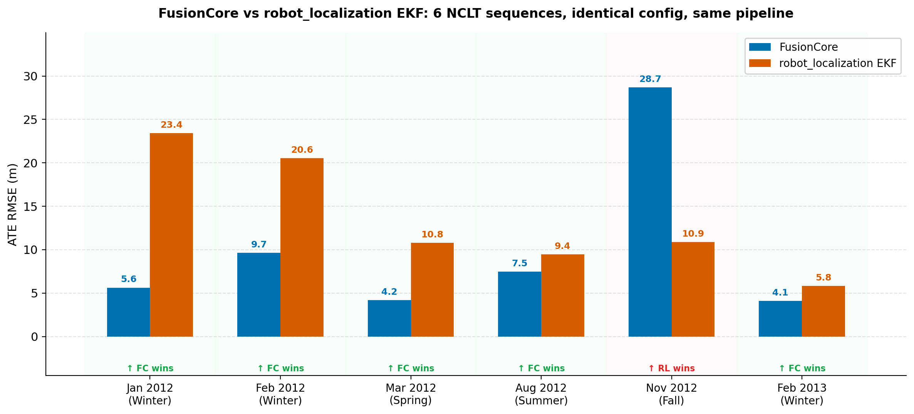
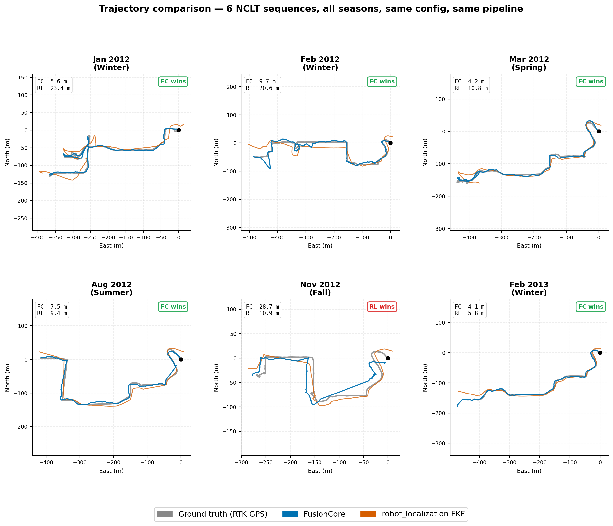

# Benchmark Results

FusionCore vs robot_localization on the [NCLT dataset](http://robots.engin.umich.edu/nclt/) (University of Michigan). Same IMU + wheel odometry + GPS inputs, no manual tuning. Six sequences, same pipeline.

  

| Sequence | FC ATE RMSE | RL-EKF ATE RMSE | RL-UKF |
|---|---|---|---|
| 2012-01-08 | **5.6 m** | 23.4 m | NaN divergence at t=31 s |
| 2012-02-04 | **9.7 m** | 20.6 m | NaN divergence at t=22 s |
| 2012-03-31 | **4.2 m** | 10.8 m | NaN divergence at t=18 s |
| 2012-08-20 | **7.5 m** | 9.4 m | NaN divergence |
| 2012-11-04 | 28.7 m | **10.9 m** | NaN divergence |
| 2013-02-23 | **4.1 m** | 5.8 m | NaN divergence |

FusionCore wins 5 of 6 sequences. RL-UKF diverged with NaN on all six.

On 2012-11-04 (fall, degraded GPS), FC's Mahalanobis outlier gate still loses: GPS was sufficiently degraded for long enough that accumulated drift could not be fully recovered. RL-EKF has no rejection gate and self-corrects immediately when GPS comes back.

  

---

## Reproduce

Full methodology, configs, and reproduce instructions in [`benchmarks/`](https://github.com/manankharwar/fusioncore/tree/main/benchmarks).
